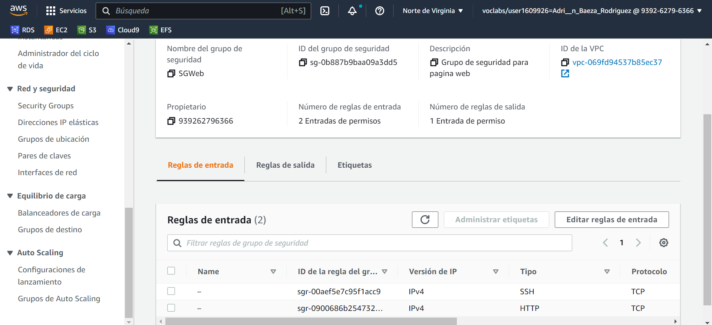

# Práctica 4.6: Documentación final Clúster Web, MultiAZ

En esta práctica vamos a crear una arquitectura EFS-EC2-MultiAZ en la nube de AWS. Para ello necesitamos crear dos máquinas EC2 y un sistema de archivos EFS. También enlazaremos todo con una RDS y con un EC2 balanceador.

**1. Creación de grupos de seguridad**

Primero debemos crear dos nuevos grupos de seguridad, uno que servirá para la página web al que llamaremos SGWeb, y otro para el sistema de archivos EFS, que se llamará SGEfs.
La base de datos RDS y el balanceador también contarán con sus grupos de seguridad.

Para el grupo SGWeb, crearemos dos reglas de entrada:
- Una regla tipo SSH en el puerto 22
- Una regla tipo HTTP en el puerto 80

Para el grupo SGEfs, crearemos la siguiente regla de entrada:
- Una regla tipo NFS en el puerto 2049

En el grupo de seguridad de nuestra RDS (en este caso SGMYSQL), vamos a crear la siguiente regla de entrada:
- Una regla tipo MYSQL/Aurora en el puerto 3306

En el grupo de seguridad de nuestro balanceador, vamos a crear dos reglas de entrada:
- Una regla tipo SSH en el puerto 22
- Una regla HTTP en el puerto 80

A continuación, vamos a crear las dos instancias EC2.

**2. Creación EC2**

Vamos a crear dos instancias EC2 de la siguiente forma:
- AMI Amazon Linux
- Tipo t2.micro
- Configuraciones de red
  - VPC predeterminada
  - Subred con zona de disponibilidad us-east-1a en una máquina, y zona de disponibilidad us-east-1b en la otra
  
  - Habilitar asignación de IP pública automáticamente
  - Almacenamiento por defecto
  - Seleccionar grupo de seguridad existente SGWeb (aquí podríamos haber creado uno nuevo en caso de no crearlo anteriormente).
  - En Detalles avanzados --> Datos de usuario, insertaremos los siguientes comandos para la instalación automática de estos al crear nuestras EC2 (también pueden insertarse al arrancar la máquina si no introducimos nada en este paso):
    - #!/bin/bash
    - yum update -y
    - yum install httpd -y
    - systemctl start httpd
    - systemctl enable httpd
    - yum -y install nfs-utils

A continuación se muestran las máquinas creadas:

Una vez creadas las EC2, procedemos a crear un sistema de archivos EFS.

**3. Creación EFS**

Para la creación del Efs utilizaremos las siguientes características:

Una vez creada, tenemos que enlazar las zonas de disponibilidad que vamos a utilizar (en este caso, us-east-1a y us-east-1b), con nuestro grupo de seguridad creado anteriormente para Efs.

**4. Creación balanceador**

A continuación, crearemos un balanceador que conectará las dos instancias EC2. Como AMI elegiremos Ubuntu, y habilitaremos el tráfico HTTP. El resto de configuraciones las dejaremos por defecto.

**5. Creación RDS**

También vamos a crear una base de datos, a la cuál posteriormente le pasaremos datos a través de nuestra página web. En este caso, tiene las siguientes configuraciones:

**6. Conexión a las máquinas EC2**

Al crear toda la arquitectura, pasaremos a conectarnos a cada una de las máquinas EC2, de la siguiente forma:

**7. Configuración e instalación página web**

Una vez en la consola de cualquiera de nuestras EC2 (al estar enlazadas los cambios se realizan en ambas máquinas), podemos comprobar el estado de apache, para saber si se instaló de forma correcta al introducir los datos de usuario en la creación de las EC2:

A continuación, vamos a crear el directorio donde se va a almacenar la página web, y posteriormente montaremos el sistema de archivos. Primero accedemos a la ruta *"var/www/html"*, donde crearemos el directorio. Lo creamos y montamos nuestro sistema, mediante los siguientes comandos:

Comprobamos que nuestro sistema de archivos accederá correctamente a la ruta especificada, de la siguiente forma:

Accedemos al directorio *"efs-mount"*, donde vamos a guardar la página web, y la descargamos:

A continuación descomprimimos el archivo zip descargado, dejando en nuestro directorio los archivos necesarios para la página web.

En la siguiente imagen se muestran los archivos creados para tener una página web personalizada. En este caso, hemos editado el index.html y el style.css para cambiar el estilo de la página, y hemos creado varios php que sirven para introducir datos y enlazarlos con la base de datos.

Posteriormente, tenemos que editar el archivo *"httpd.conf"*, de forma que nos permita acceder a la web simplemente introduciendo la dirección IP como url.

Para ello, cambiaremos la ruta del documento a nuestro directorio *"efs-mount"*:

Al editar y guardar los cambios, ya sería posible introducir la dirección IP de cualquiera de nuestras máquinas EC2 en cualquier navegador, y debería dirigirnos a la página web. Aunque en este caso, el tráfico se gestiona mediante un balanceador para tener las IPs de nuestras máquinas protegidas, por lo que sólo podremos acceder por URL a la IP de nuestro balanceador.

Posteriormente, nos conectaremos al balanceador mediante conexión EC2 y una vez dentro, le instalamos apache2 (*"sudo apt install apache2"*).
Al instalar apache2, necesitamos introducir la siguiente serie de comandos que servirán para permitir que nuestra EC2 actúe como balanceador:

Al introducirlos, reiniciamos apache2 (*"sudo systemctl restart apache2"*). Posteriormente, vamos a editar el archivo *"000-default.conf"* que se encuentra en el directorio *"/etc/apache2/sites-enabled"*. Dentro del archivo, introduciremos el siguiente texto:

Como vemos en la imagen, debemos introducir el nuevo texto al final del archivo, encima de la etiqueta de cierre *"VirtualHost"*. Guardamos el archivo y salimos. Al terminar esto, debería accedernos a nuestra página web de Netflix introduciendo la IP del balanceador. Si accede de forma correcta, ya tendríamos nuestra infraestructura terminada. Para terminar la securizaremos de forma que no permitamos tráfico externo.

**8. Securización de la infraestructura**

A continuación, y como último paso, vamos a securizar nuestra infraestructura editando varios grupos de seguridad.

En primer lugar, editaremos el grupo de seguridad SGWeb. En el origen de la regla de entrada HTTP introduciremos la IP pública del balanceador, en lugar de la 0.0.0.0 (todo el tráfico), de la siguiente manera:

Posteriormente, vamos a editar el grupo de seguridad SGMYSQL. En el origen de la regla de entrada MYSQL/Aurora introduciremos el grupo de seguridad SGWeb, de la siguiente forma:

Por último, vamos a editar el grupo de seguridad SGEfs. En el origen de la regla de entrada NFS introduciremos el grupo de seguridad SGWeb, por lo que quedará así:

Si está todo correcto, debería funcionar toda la página web.
